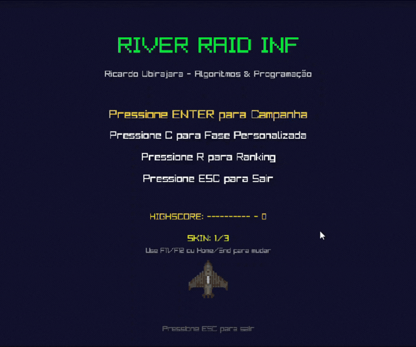

# RIVER-INF - Algoritmos e Programação (UFRGS)

## *Português*

### Visão Geral do Projeto

O RIVER-INF é um jogo de tiro vertical desenvolvido em C utilizando a biblioteca **Raylib**. Inspirado no clássico *River Raid* do Atari 2600, este projeto foi desenvolvido como Trabalho Prático Final da disciplina de Algoritmos e Programação (INF01202) na UFRGS (2025/2).

### Funcionalidades Principais

* **Lógica Modular:** Código estruturado em módulos (core, map, player, etc.) para melhor organização.
* **Carregamento de Mapas:** As fases são lidas de arquivos `.txt` baseados em uma matriz de 24x20.
* **Persistência de Dados:** O sistema de recordes é gerenciado via arquivo binário (`highscore.bin`).
* **Mecânicas:** Gestão de combustível, destruição de inimigos (navios e helicópteros) e progressão de nível através da destruição de pontes.

### Compilação e Execução

1. Primeiro baixe o MinGW diretamente do site oficial. Descompacte o MinGW em qualquer pasta do sistema, por exemplo `C:/MinGW`.

2. Depois adicione o caminho da pasta bin do MinGW na variável de ambiente PATH do Windows. Abra um terminal e verifique se funciona executando `gcc --version`.

3. Em seguida baixe a Raylib já compilada para MinGW. Extraia a Raylib exatamente em `C:/raylib` mantendo as pastas include e lib.

4. Depois disso clone ou copie o projeto para qualquer pasta do seu computador. Certifique-se de que o arquivo Makefile está na raiz do projeto.

5. Abra o prompt de comando ou o terminal na pasta do projeto. Execute o comando `mingw32-make river-inf`.

6. O executável do jogo será gerado na mesma pasta. O jogo será executado automaticamente após a compilação.

## *English*

### Project Overview

RIVER-INF is a vertical-scrolling shooter developed in C using the **Raylib** library. Inspired by the Atari 2600 classic *River Raid*, this project was created as the Final Practical Assignment for the Algorithms and Programming course (INF01202) at UFRGS (2025/2).

### Key Features

* **Modular Logic:** Structured in modules (core, map, player, etc.) for better maintainability.
* **Map Loading:** Levels are loaded from `.txt` files using a 24x20 grid system.
* **Persistence:** High scores are stored and managed through a binary file (`highscore.bin`).
* **Gameplay:** Includes fuel management, enemy destruction (ships and helicopters), and level transitions via bridge destruction.

### Build and Execution

1. Download MinGW from the official website. Extract it to any system folder (e.g., `C:/MinGW`).

2. Add the MinGW bin folder path to the Windows PATH environment variable. Verify by running `gcc --version` in your terminal.

3. Download the pre-compiled Raylib for MinGW. Extract it exactly to `C:/raylib`, ensuring the include and lib folders are present.

4. Clone or copy the project to your computer. Ensure the Makefile is located in the project root.

5. Open the command prompt or terminal in the project folder and run: `mingw32-make river-inf`.

6. The executable will be generated in the same folder, and the game will launch automatically after compilation.


### Game Images / Imagens do Jogo

<div align="center">
  
</div>


## Project Structure / Estrutura do Projeto

```text
RIVER INF/
│   Makefile                     # Script de compilação do projeto (build, testes e execução)
│   readme.md                    # Documentação básica do projeto
│   readme.txt                   # Versão alternativa da documentação em txt
│   river-inf.exe                # Executável final do jogo compilado no Windows
│
└── src/                         # Código-fonte principal do projeto
    │   main.c                   # Ponto de entrada do programa e inicialização do jogo
    │
    ├── assets/                  # Recursos externos do jogo
    │   ├── airplanes/           # Imagens das skins do jogador
    │   │   air1.png             # Skin de avião 1
    │   │   air2.png             # Skin de avião 2
    │   │   air3.png             # Skin de avião 3
    │   │
    │   ├── maps/                # Arquivos de mapas das fases
    │   │   fase1.txt            # Layout da fase 1
    │   │   fase2.txt            # Layout da fase 2
    │   │   fase3.txt            # Layout da fase 3
    │   │   fase4.txt            # Layout da fase 4
    │   │   fase5.txt            # Layout da fase 5
    │   │
    │   └── obstacles/           # Imagens dos obstáculos do jogo
    │       bridge.png           # Ponte
    │       gas.png              # Gasolina / reabastecimento
    │       helicopter.png       # Helicóptero inimigo
    │       ship.png             # Navio inimigo
    │       terrain.png          # Terra
    │
    ├── core/                    # Implementação da lógica principal do jogo
    │   bullet.c                 # Sistema de tiros e projéteis
    │   game.c                   # Gerenciamento de estados e loop principal
    │   highscore.c              # Sistema de pontuação e ranking
    │   map.c                    # Leitura, carregamento e interpretação dos mapas
    │   obstacle.c               # Sistema de obstáculos, inimigos e colisões
    │   player.c                 # Lógica e controle do jogador
    │
    ├── include/                 # Headers (interfaces dos módulos)
    │   bullet.h                 # Interface do sistema de tiros
    │   defines.h                # Constantes globais e definições gerais
    │   game.h                   # Interface do módulo principal do jogo
    │   highscore.h              # Interface do sistema de pontuação
    │   map.h                    # Interface do sistema de mapas
    │   obstacle.h               # Interface do sistema de obstáculos
    │   player.h                 # Interface do sistema do jogador
    │
    └── tests/                   # Testes unitários dos módulos
        test_bullet.c            # Testes do sistema de tiros
        test_highscore.c         # Testes do sistema de pontuação
        test_map.c               # Testes do carregamento de mapas
        test_obstacle.c          # Testes do sistema de obstáculos
        test_player.c            # Testes da lógica do jogador
```