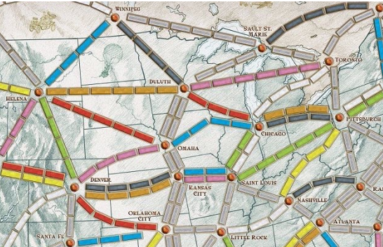

# Busca de Caminhos em Grafos - Racket

Este projeto implementa um algoritmo de busca em grafos para encontrar todos os caminhos possíveis entre duas cidades, utilizando o paradigma de programação funcional.

## *Português*

### Visão Geral
O trabalho consiste na representação de um mapa de cidades norte-americanas como um grafo não dirigido e na implementação de um motor de busca que explora todas as conexões viáveis entre uma origem e um destino.

### Implementação Técnica
* **Representação de Dados:** Uso de estruturas customizadas (`define-struct nodo`) contendo o nome da cidade e uma lista de vizinhos.
* **Algoritmo de Busca:** Implementação de busca em profundidade com controle de estado (lista de visitados) para prevenir loops infinitos e garantir a terminação do algoritmo.
* **Recursão Generativa:** O algoritmo gera novas possibilidades de caminhos a cada passo, filtrando nodos já explorados para encontrar soluções válidas.

---

## *English*

### Project Overview
This project implements a graph search algorithm to find all possible paths between two cities, using the functional programming paradigm.

### Technical Highlights
* **Data Representation:** Custom structures (`define-struct node`) holding the city name and its adjacency list.
* **Search Algorithm:** Depth-first search approach with state control (visited list) to prevent infinite cycles and ensure convergence.
* **Generative Recursion:** The algorithm dynamically explores branches of the graph, filtering out previously visited nodes to return all valid path combinations.


### O Mapa de Referência / Reference Map
Abaixo está a representação visual dos nodos e conexões utilizados para construir a estrutura de dados no código:

<div align="center">
  
</div>

---

## Como Executar / How to Run

1. Instale o **DrRacket** (ambiente oficial da linguagem Racket).
2. Abra o arquivo `.rkt` do projeto.
3. Configure a linguagem para **Advanced Student Language** (Linguagem do Estudante Avançado).
4. Clique em **Run** (Executar) e explore o code.

```text
Exemplo de entrada (Console):
> numero-de-caminhos

Exemplo de saída:
> 1889
```